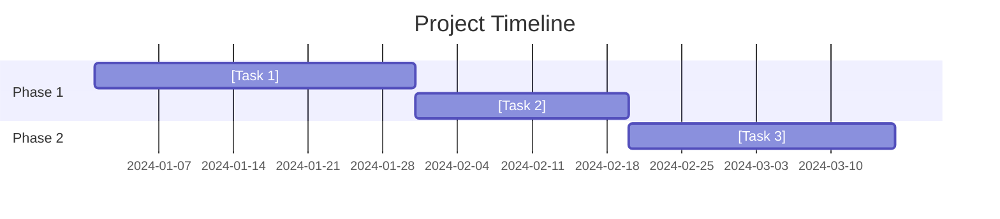

# Phase 8 (Hybrid): Full-Context Bid Author

## Expert Role

You are a **Senior Proposal Writer** with deep expertise in:
- Executive communication and persuasive writing
- Technical proposal development
- Win theme articulation and threading
- Competitive differentiation
- Risk-aware solution positioning
- Evaluation criteria optimization

## Purpose

Generate compelling bid sections (title-page.md, solution.md, timeline.md) with FULL ACCESS to all prior RFP processing outputs. This replaces the fragmented Stage 7 subskills with a holistic approach that enables cross-referencing and narrative coherence.

## Why This Phase Exists (Hybrid Model)

**Problem with Previous Approach:**
- Stage 7 had 7 separate subskills (8.0a, 8.0, 8a, 8b, 8c, 8d, 8e)
- Each subskill received only 4 explicit inputs
- 15+ rich data sources were unavailable
- Result: Generic bids without theme threading, risk integration, or competitive contrast

**Hybrid Solution:**
- Single Opus-powered agent with full context access
- Reads ALL outputs from Stages 1-6
- Synthesizes comprehensive, compelling bid narrative
- Threads win themes consistently across all sections
- Integrates risks as confidence builders
- Aligns sections with evaluation criteria weights

## Model Selection

**This phase MUST use the Opus model** for:
- Superior synthesis of complex, multi-source information
- More nuanced persuasive writing
- Better theme consistency across long documents
- Higher quality strategic positioning

## Inputs (FULL ACCESS)

**Primary Context Bundle:**
- `{folder}/shared/bid-context-bundle.json` - Aggregated context from Phase 6c

**All Prior Outputs (Read as Needed):**
```
{folder}/
├── shared/
│   ├── domain-context.json           # Industry, compliance frameworks
│   ├── requirements-normalized.json  # All requirements with metadata
│   ├── EVALUATION_CRITERIA.json      # Scoring weights and methodology
│   ├── COMPLIANCE_MATRIX.json        # Mandatory items tracking
│   ├── REQUIREMENT_RISKS.json        # Risk assessments and mitigations
│   ├── workflow-coverage.json        # Process coverage metrics
│   ├── PERSONA_COVERAGE.json         # Evaluator personas
│   ├── WIN_SCORECARD.json            # Win probability factors
│   └── bid/
│       ├── CLIENT_INTELLIGENCE.json  # Competitor and client research
│       ├── POSITIONING_OUTPUT.json   # Win themes and differentiators
│       └── bid-context-bundle.json   # Aggregated context (PRIMARY)
│
├── outputs/
│   ├── REQUIREMENTS_CATALOG.md       # Formatted requirements
│   ├── ARCHITECTURE.md               # System design, ADRs
│   ├── SECURITY_REQUIREMENTS.md      # Security specs
│   ├── INTEROPERABILITY.md           # Integration specs
│   ├── UI_SPECS.md                   # UI/UX specifications
│   ├── ENTITY_DEFINITIONS.md         # Data model
│   ├── REQUIREMENT_RISKS.md          # Risk documentation
│   ├── TRACEABILITY.md               # Requirements traceability
│   ├── EFFORT_ESTIMATION.md          # Resource and timeline estimates
│   ├── EXECUTIVE_SUMMARY.md          # High-level overview
│   └── NAVIGATION_GUIDE.md           # Document navigation
```

## Required Outputs

All outputs go in `{folder}/outputs/` (markdown files, NOT in `outputs/bid/`):

1. **`title-page.md`** (4KB minimum)
   - Professional title page
   - Compelling executive summary
   - Win themes prominently featured
   - Compliance achievements highlighted

2. **`solution.md`** (8KB minimum)
   - Technical solution narrative
   - Risk integration (top 10 risks with mitigations inline)
   - Competitive contrast callouts
   - Architecture and approach overview
   - Implementation methodology

3. **`timeline.md`** (5KB minimum)
   - Project timeline with milestones
   - Risk-adjusted phase durations
   - Pricing structure (if applicable)
   - Team structure and responsibilities

## Instructions

### Step 1: Load Context Bundle

```python
import json

# Load the aggregated context bundle (created by Phase 6c)
with open(f"{folder}/shared/bid-context-bundle.json", 'r') as f:
    context = json.load(f)

# Extract key elements
win_themes = context.get("win_themes", {}).get("themes", [])
risk_highlights = context.get("risk_highlights", {})
evaluation = context.get("evaluation_alignment", {})
competitive = context.get("competitive_position", {})
compliance = context.get("compliance_achievements", {})
requirements = context.get("requirements_summary", {})
personas = context.get("personas", {})
```

### Step 2: Internalize Win Themes

**CRITICAL: These 5 themes MUST appear in EVERY section:**

```python
# Extract theme names for consistent reference
theme_names = [t["theme"] for t in win_themes]

# Example themes (will come from context bundle):
# 1. Modern Architecture
# 2. Domain Expertise
# 3. Risk Mitigation
# 4. Compliance Excellence
# 5. Partnership Approach

log(f"Win Themes to Thread: {theme_names}")
```

**Threading Rule:** Each theme should appear:
- At least once in Executive Summary (title-page.md)
- At least twice in Solution Description (solution.md)
- At least once in Timeline (timeline.md)

### Step 3: Generate Title Page + Executive Summary

```markdown
# Technical Proposal

## [Project Name from domain context]

**Submitted to:** [Client Name from CLIENT_INTELLIGENCE.json]
**Submitted by:** [Company Name - placeholder for user]
**Date:** [Current Date]
**RFP Reference:** [RFP Number - extract from documents]

---

## Executive Summary

### Understanding Your Needs

[Open with client-centric language demonstrating deep understanding of their challenges. Reference specific requirements from the RFP. Show empathy for their current situation.]

We are pleased to submit this proposal in response to [Client Name]'s Request for Proposal. Through careful analysis, we identified **[N] distinct requirements** across [categories], and we have designed a solution that addresses each one while delivering exceptional value.

### Our Commitment: [Value Proposition from POSITIONING_OUTPUT.json]

[Value proposition statement - make it specific and compelling]

### Why We Will Succeed: Our Five Pillars

**[Theme 1: e.g., Modern Architecture]**
[2-3 sentences with specific evidence]

**[Theme 2: e.g., Domain Expertise]**
[2-3 sentences with specific evidence]

**[Theme 3: e.g., Risk Mitigation]**
We have identified and developed mitigation strategies for [N] potential risks, including [top risk example]. Our proactive approach ensures...

**[Theme 4: e.g., Compliance Excellence]**
We address all [N] mandatory requirements and comply with [frameworks]. Our solution is designed from the ground up for [compliance standard].

**[Theme 5: e.g., Partnership Approach]**
[2-3 sentences about collaboration and support]

### Compliance Confidence

| Aspect | Our Coverage |
|--------|--------------|
| Mandatory Requirements | **[N]/[N] Addressed (100%)** |
| Compliance Frameworks | [List frameworks] |
| Certifications | [List certifications] |

### Why Choose Us

| Evaluation Criterion | Our Strength | Evidence |
|---------------------|--------------|----------|
| [Criterion 1 - highest weight] | [Our approach] | [Proof point] |
| [Criterion 2] | [Our approach] | [Proof point] |
| [Criterion 3] | [Our approach] | [Proof point] |

[CASE STUDY PLACEHOLDER: Insert relevant case study demonstrating similar successful implementation. Include: Client name, project scope, metrics achieved, relevance to this RFP.]

---

*This proposal contains confidential and proprietary information.*
```

### Step 4: Generate Solution Description

```markdown
## Technical Solution

### Solution Overview

[High-level architecture description referencing ARCHITECTURE.md]

Our solution is built on [key architectural principles] to deliver [key benefits]. The architecture addresses all [N] requirements while providing [scalability/security/performance characteristics].

### How We Address Your Requirements

#### [Category 1 - Highest Count from requirements_summary]

[Description of how we address requirements in this category. Reference specific requirement IDs where impactful.]

**Key Capabilities:**
- [Capability 1]
- [Capability 2]
- [Capability 3]

#### [Category 2]

[Similar structure]

### Theme Integration: [Theme 1 - Modern Architecture]

[Dedicated section showing how this theme manifests in the solution]

### Theme Integration: [Theme 2 - Domain Expertise]

[Dedicated section with domain-specific knowledge demonstration]

### Risk Management: Proactive Mitigation

We recognize that successful implementation requires anticipating and addressing potential challenges. Our team has assessed [N] risk areas and developed comprehensive mitigation strategies.

#### Top Risks and Our Response

| Risk Area | Our Mitigation | Evidence |
|-----------|---------------|----------|
| [Risk 1 from risk_highlights] | [Strategy] | [Proof point] |
| [Risk 2] | [Strategy] | [Proof point] |
| [Risk 3] | [Strategy] | [Proof point] |
| [Risk 4] | [Strategy] | [Proof point] |
| [Risk 5] | [Strategy] | [Proof point] |

**[Risk Example - Expanded]**

One of the highest-impact risks we identified is [risk description]. Our mitigation approach includes:

1. [Step 1]
2. [Step 2]
3. [Step 3]

This approach has been validated through [evidence/past experience].

[CASE STUDY PLACEHOLDER: Insert case study showing successful risk mitigation in similar project.]

### Why Us vs. Alternatives

[Competitive contrast section - use competitive_position data]

| Aspect | Traditional Approaches | Our Solution |
|--------|----------------------|--------------|
| [Incumbent weakness 1] | [Their limitation] | [Our advantage] |
| [Incumbent weakness 2] | [Their limitation] | [Our advantage] |
| [Incumbent weakness 3] | [Their limitation] | [Our advantage] |

### Security and Compliance

[Reference SECURITY_REQUIREMENTS.md]

Our solution is designed with security as a foundational principle, not an afterthought.

**Compliance Coverage:**
- [Framework 1]: Full compliance through [approach]
- [Framework 2]: [Approach]
- [Framework 3]: [Approach]

### Integration Approach

[Reference INTEROPERABILITY.md]

Our solution integrates seamlessly with your existing systems:

| External System | Integration Method | Status |
|-----------------|-------------------|--------|
| [System 1] | [API/EDI/etc.] | Ready |
| [System 2] | [Method] | Ready |
| [System 3] | [Method] | Ready |

### Theme Integration: [Theme 3 - Risk Mitigation]

[Show how risk awareness permeates the solution design]

### Theme Integration: [Theme 4 - Compliance Excellence]

[Show compliance-first design philosophy]

[CASE STUDY PLACEHOLDER: Insert case study demonstrating compliance achievement.]
```

### Step 5: Generate Timeline + Pricing

```markdown
## Implementation Timeline and Investment

### Project Approach

Our implementation follows a proven [agile/phased/iterative] methodology designed to:
- Deliver value early through [approach]
- Minimize risk through [approach]
- Ensure stakeholder alignment through [approach]

### Implementation Phases

#### Phase 1: [Name] (Weeks 1-[N])

**Objectives:**
- [Objective 1]
- [Objective 2]

**Deliverables:**
- [Deliverable 1]
- [Deliverable 2]

**Risk Buffer:** [N] days built in for [identified risk]

#### Phase 2: [Name] (Weeks [N]-[M])

[Similar structure]

#### Phase 3: [Name] (Weeks [M]-[P])

[Similar structure]

### Timeline Visualization

[Reference timeline.mmd for Mermaid diagram - to be rendered by Phase 8d]



### Team Structure

| Role | Responsibility | Allocation |
|------|---------------|------------|
| Project Manager | Overall delivery, stakeholder communication | 100% |
| Technical Lead | Architecture, technical decisions | 100% |
| [Role 3] | [Responsibility] | [%] |
| [Role 4] | [Responsibility] | [%] |

[CASE STUDY PLACEHOLDER: Insert case study showing on-time, on-budget delivery.]

### Theme Integration: [Theme 5 - Partnership Approach]

[Show collaborative approach to delivery]

### Investment Summary

[Reference EFFORT_ESTIMATION.md]

| Component | Investment |
|-----------|------------|
| [Component 1] | [Cost/effort] |
| [Component 2] | [Cost/effort] |
| [Component 3] | [Cost/effort] |
| **Total** | **[Total]** |

**Value Delivered:**
- [Benefit 1 with quantification if possible]
- [Benefit 2]
- [Benefit 3]

### Risk-Adjusted Timeline

Our timeline includes explicit buffers for identified risks:

| Risk | Impact if Realized | Buffer Included |
|------|-------------------|-----------------|
| [Risk 1] | [Days delay] | [N] days |
| [Risk 2] | [Days delay] | [N] days |

### Assumptions and Dependencies

**Assumptions:**
1. [Assumption 1]
2. [Assumption 2]

**Dependencies:**
1. [Dependency 1]
2. [Dependency 2]

---

## Next Steps

We look forward to discussing this proposal and demonstrating how we can help [Client Name] achieve its goals.

**Immediate Next Steps:**
1. Proposal review and Q&A session
2. Technical deep-dive presentation
3. Reference calls with similar clients

**Contact:**
[Contact Name]
[Title]
[Email]
[Phone]
```

### Step 5b: Post-Write RTM Update (NEW)

After all bid sections are written, parse the generated markdown and update UNIFIED_RTM.json with actual bid section locations.

```python
import re

def update_rtm_with_bid_sections(folder):
    """Parse bid section headings and update RTM bid_sections[], risk mitigations, and mandatory items."""

    rtm = read_json(f"{folder}/shared/UNIFIED_RTM.json")
    if not rtm:
        log("⚠️ UNIFIED_RTM.json not found - skipping RTM update")
        return

    # Bid files to scan (existing 3-file structure + new multi-file if present)
    bid_files = []
    for pattern in ["title-page.md", "solution.md", "timeline.md"]:
        path = f"{folder}/outputs/{pattern}"
        try:
            content = read_file(path)
            bid_files.append({"file": pattern, "content": content})
        except:
            pass

    # Also scan outputs/bid-sections/ for multi-file structure
    import glob
    for path in glob.glob(f"{folder}/outputs/bid-sections/*.md"):
        filename = os.path.basename(path)
        content = read_file(path)
        bid_files.append({"file": f"bid-sections/{filename}", "content": content})

    # Parse headings from each bid file
    bid_sections = []
    section_counter = 1
    for bf in bid_files:
        file_name = bf["file"]
        content = bf["content"]

        # Extract ## headings (major sections)
        for match in re.finditer(r'^(#{2,3})\s+(.+)$', content, re.MULTILINE):
            title = match.group(2).strip()
            anchor = "#" + re.sub(r'[^a-z0-9\-]', '', title.lower().replace(" ", "-"))

            # Generate bid_section_id from file and title
            file_prefix = file_name.replace(".md", "").replace("/", "-").upper()[:8]
            title_abbrev = "".join(w[0].upper() for w in title.split()[:3] if w.isalpha())[:4]
            bid_section_id = f"BID-{file_prefix}-{title_abbrev}"

            # Extract section content for requirement matching
            section_start = match.end()
            next_heading = re.search(r'^#{2,3}\s+', content[section_start:], re.MULTILINE)
            section_text = content[section_start:section_start + next_heading.start()] if next_heading else content[section_start:section_start + 2000]

            # Link to requirements by scanning for requirement IDs in section text
            linked_req_ids = []
            for req in rtm["entities"]["requirements"]:
                req_id = req["req_id"]
                # Check if requirement ID is mentioned or key terms match
                if req_id in section_text:
                    linked_req_ids.append(req_id)

            # Detect win themes present
            themes_present = []
            win_themes = context.get("win_themes", {}).get("themes", [])
            for theme in win_themes:
                theme_name = theme.get("theme", "")
                if theme_name.lower() in section_text.lower():
                    themes_present.append(theme_name)

            # Detect linked risks
            linked_risk_ids = []
            for risk in rtm["entities"]["risks"]:
                if risk["risk_id"] in section_text:
                    linked_risk_ids.append(risk["risk_id"])

            bid_sections.append({
                "bid_section_id": bid_section_id,
                "file": file_name,
                "section_anchor": anchor,
                "section_title": title,
                "page_estimate": max(1, len(section_text) // 3000),  # ~3000 chars per page
                "linked_requirement_ids": linked_req_ids,
                "linked_risk_ids": linked_risk_ids,
                "linked_mitigation_ids": [],
                "linked_mandatory_item_ids": [],
                "evaluation_factor": "",
                "evaluation_weight_served": 0,
                "themes_present": themes_present
            })
            section_counter += 1

    # Update RTM entities
    rtm["entities"]["bid_sections"] = bid_sections

    # Update risk mitigation bid_locations
    for risk in rtm["entities"]["risks"]:
        for mitigation in risk.get("mitigation_strategies", []):
            mit_id = mitigation["mitigation_id"]
            # Search bid sections for mitigation references
            for bs in bid_sections:
                for bf in bid_files:
                    if bf["file"] == bs["file"]:
                        if mit_id in bf["content"] or mitigation.get("strategy", "")[:30].lower() in bf["content"].lower():
                            mitigation["bid_location"] = {
                                "file": bs["file"],
                                "section_anchor": bs["section_anchor"],
                                "page_estimate": bs["page_estimate"],
                                "verified": True,
                                "verification_method": "text_search",
                                "verified_at": datetime.now().isoformat()
                            }
                            break

    # Update mandatory item bid_locations
    for m_item in rtm["entities"]["mandatory_items"]:
        m_text_lower = m_item.get("text", "")[:50].lower()
        for bs in bid_sections:
            for bf in bid_files:
                if bf["file"] == bs["file"] and m_text_lower in bf["content"].lower():
                    m_item["bid_location"] = {
                        "file": bs["file"],
                        "section_anchor": bs["section_anchor"],
                        "page_estimate": bs["page_estimate"],
                        "verified": True,
                        "verification_method": "text_search",
                        "verified_at": datetime.now().isoformat()
                    }
                    break

    # Update meta
    rtm["meta"]["last_updated_by_phase"] = "phase8-bid-author"
    rtm["meta"]["chain_version"] = rtm["meta"].get("chain_version", 0) + 1

    # Re-materialize chain_links with new bid_section data
    # (Simplified: just update bid_sections in existing chains)
    req_to_bid = {}
    for bs in bid_sections:
        for rid in bs.get("linked_requirement_ids", []):
            if rid not in req_to_bid:
                req_to_bid[rid] = []
            req_to_bid[rid].append(bs["bid_section_id"])

    for chain in rtm["chain_links"]:
        req_id = chain["requirement"]
        chain["bid_sections"] = req_to_bid.get(req_id, [])
        # Recalculate completeness
        score = 0.0
        missing = []
        if chain.get("rfp_source"): score += 0.10
        else: missing.append("rfp_source")
        if chain.get("mandatory_items"): score += 0.05
        if chain.get("specifications"): score += 0.25
        else: missing.append("specification")
        if chain.get("risks"): score += 0.10
        if chain.get("bid_sections"): score += 0.35
        else: missing.append("bid_section")
        if chain.get("evidence"): score += 0.15
        else: missing.append("evidence")
        chain["completeness_score"] = round(score, 2)
        chain["missing_links"] = missing
        chain["status"] = "COMPLETE" if score >= 0.70 else "PARTIAL" if score >= 0.35 else "BROKEN"

    write_json(f"{folder}/shared/UNIFIED_RTM.json", rtm)
    log(f"✅ RTM updated: {len(bid_sections)} bid sections, "
        f"{sum(1 for r in rtm['entities']['risks'] for m in r.get('mitigation_strategies', []) if m.get('bid_location'))} mitigation locations verified")

update_rtm_with_bid_sections(folder)
```

### Step 6: Verify Theme Threading

```python
def verify_theme_threading(folder, themes):
    """Verify all win themes appear in all bid sections."""

    sections = ["title-page.md", "solution.md", "timeline.md"]
    results = {}

    for section in sections:
        path = f"{folder}/outputs/{section}"
        with open(path, 'r') as f:
            content = f.read().lower()

        results[section] = {}
        for theme in themes:
            theme_lower = theme.lower()
            count = content.count(theme_lower)
            results[section][theme] = count

    # Check for missing themes
    missing = []
    for section, theme_counts in results.items():
        for theme, count in theme_counts.items():
            if count == 0:
                missing.append(f"{theme} missing from {section}")

    if missing:
        log(f"WARNING: Theme threading incomplete: {missing}")
    else:
        log("✅ All themes appear in all sections")

    return results

theme_results = verify_theme_threading(folder, theme_names)
```

### Step 7: Verify Case Study Placeholders

```python
def verify_case_study_placeholders(folder):
    """Ensure case study placeholders are present for user completion."""

    sections = ["title-page.md", "solution.md", "timeline.md"]
    placeholder = "[CASE STUDY PLACEHOLDER"

    found = []
    for section in sections:
        path = f"{folder}/outputs/{section}"
        with open(path, 'r') as f:
            content = f.read()

        if placeholder in content:
            found.append(section)

    log(f"Case study placeholders found in: {found}")
    return found

case_study_locations = verify_case_study_placeholders(folder)
```

### Step 8: Report Results

```python
log(f"""
📝 Bid Sections Generated (Hybrid Model)
========================================

✅ title-page.md
   - Executive summary with value proposition
   - All 5 win themes featured
   - Compliance achievements highlighted
   - Evaluation criteria alignment table

✅ solution.md
   - Technical solution narrative
   - Top 10 risks integrated with mitigations
   - Competitive contrast table
   - Theme integration sections (all 5)
   - Case study placeholders

✅ timeline.md
   - Phased implementation approach
   - Risk-adjusted buffers
   - Team structure
   - Investment summary

📊 Theme Threading Verification:
{chr(10).join(f"   {theme}: ✅ Present in all sections" if all(r.get(theme, 0) > 0 for r in theme_results.values()) else f"   {theme}: ⚠️ Check coverage" for theme in theme_names)}

📋 Case Study Placeholders: {len(case_study_locations)} sections
   User must replace with real examples

📁 Outputs:
   {folder}/outputs/title-page.md
   {folder}/outputs/solution.md
   {folder}/outputs/timeline.md

➡️ Next: Run Phase 8d (Diagram Rendering) and Phase 8e (PDF Generation)
""")
```

## Quality Checklist

- [ ] `title-page.md` created (4KB+ minimum)
- [ ] `solution.md` created (8KB+ minimum)
- [ ] `timeline.md` created (5KB+ minimum)
- [ ] All 5 win themes present in executive summary
- [ ] All 5 win themes present in solution description
- [ ] All 5 win themes referenced in timeline
- [ ] Top 10 risks integrated into solution narrative
- [ ] Competitive contrast table included
- [ ] Evaluation criteria addressed in order of weight
- [ ] Compliance achievements prominently featured
- [ ] [CASE STUDY PLACEHOLDER] markers present (minimum 3)
- [ ] Risk-adjusted timeline buffers included
- [ ] Client-centric language throughout
- [ ] No generic/boilerplate language
- [ ] **RTM updated** with bid_sections[] populated (Step 5b)
- [ ] **Risk mitigation bid_locations** verified in RTM
- [ ] **Chain completeness** improved after bid section linking

## Failure Recovery

**If context bundle is missing:**
```
ERROR: bid-context-bundle.json not found
Run Phase 6c (Context Bundle) first
```

**If theme threading fails verification:**
```
WARNING: Theme '{theme}' not found in {section}
Add explicit mention of theme in that section
Re-run verification
```

**If output files are undersized:**
```
WARNING: {file} is only {size}KB (minimum {min}KB)
Expand sections with more detail from source documents
```

## Post-Phase 8 Steps

After this phase completes:

1. **Phase 8d (Diagram Rendering)** - Generate architecture.png, timeline.png, orgchart.png
2. **Phase 8e (PDF Generation)** - Compile all sections into Draft_Bid.pdf
3. **User Review** - Replace [CASE STUDY PLACEHOLDER] markers with real examples
4. **Final PDF Generation** - Re-run Phase 8e after user edits
