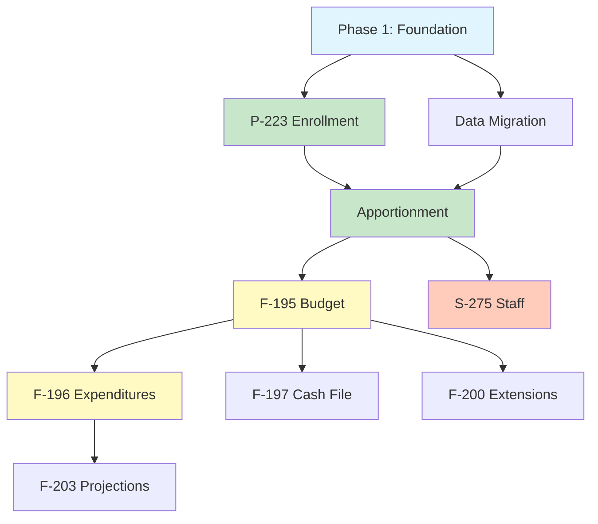

# SASQUATCH RFP Demo Analysis & Specifications

## Executive Summary

**Project:** Washington State SASQUATCH (School Apportionment and Financial Systems)
**Client:** OSPI (Office of Superintendent of Public Instruction)
**Purpose:** Win contract by demonstrating working software for school apportionment system modernization

### Team Decisions
- **Scope:** All 3 Work Sections
- **Technology:** .NET/Azure (ASP.NET Core + Azure SQL + Blazor/React)
- **Timeline:** 1-2 months for demo preparation

### Demo Format
- **Duration:** 2 hours total (includes 30-45 minutes Q&A)
- **Scoring:** 300 points per work section (900 points max)
- **Data:** Tumwater School District, 2024-25 (District Code 34033)
- **Data Source:** https://ospi.k12.wa.us/safs-data-files
- **Format:** Working software preferred; small stand-alone functional units acceptable

---

## Document Structure

This specification covers both **demo requirements** and **full implementation scope**:

| Part | Contents | Purpose |
|------|----------|---------|
| **Part 1** | Demo Sections 1-3 | Scoring criteria for 2-hour demo (900 points max) |
| **Part 2** | Complete Workflow Modernization | All 8 SAFS workflows with As-Is/To-Be mapping |
| **Part 3** | Integration Requirements | External system APIs and data exchange |
| **Part 4** | Data Migration Strategy | Access DB migration, historical data |

---

# PART 1: DEMO SECTIONS

The following three sections represent the demo acceptance criteria from the RFP. Each section can earn up to **300 points**.

---

# DEMO SECTION 1: DATA COLLECTION

## Overview
Demonstrate interfaces for school districts to submit enrollment and budget data, with validation, correction workflows, and OSPI administrative controls.

## Demo Acceptance Criteria (from RFP)

### 1.1 Enrollment Upload Example
| Requirement | Demo Must Show |
|-------------|----------------|
| Electronic upload interface | District can upload monthly enrollment file |
| By resident district | Data includes resident district breakdown |
| By school level | Enrollment broken down by individual schools |
| Manual entry | District can type/edit enrollment data directly |
| Limited technical support | UI is intuitive, self-explanatory |

### 1.2 Enrollment Validation Scenarios
| Scenario | What to Demonstrate |
|----------|---------------------|
| Month-to-month comparison | System compares current month to prior month |
| Statistical significance detection | System flags unusual variances automatically |
| District correction workflow | Districts can review edits, make corrections |
| Comment submission | Districts can submit explanations for variances |

### 1.3 Budget Upload Example
| Requirement | Demo Must Show |
|-------------|----------------|
| Electronic upload | District uploads monthly financial data file |
| Completeness checks | System validates all required fields present |
| Month-to-month comparison | Budget data compared to prior month |
| Statistical significance | Flags significant month-over-month changes |
| Unreasonable amount detection | Flags values outside expected ranges |
| Program/Activity/Object validation | Validates valid code combinations |

### 1.4 OSPI Admin Interface
| Requirement | Demo Must Show |
|-------------|----------------|
| District data review | OSPI user can view all district submissions |
| Regional (ESD) view | Group districts by Educational Service District |
| State-level view | Aggregate view across all districts |
| Approval workflow | OSPI can approve submitted data sets |

### 1.5 Data Lock Controls
| Requirement | Demo Must Show |
|-------------|----------------|
| Lock all districts | Prevent all submissions during calculation |
| Lock subset | Lock specific districts or ESDs |
| Lock single district | Lock one district for audit |
| Monthly lock | Lock for monthly calculation processing |
| Annual lock | Lock for year-end audit purposes |

## Technical Specifications

### Enrollment Data Model
```
Enrollment (P-223)
├── DistrictCode (CCDDD - e.g., 34033 for Tumwater)
├── SchoolCode
├── Month (September=1 through August=12)
├── SchoolYear (e.g., 2024-25)
├── GradeLevel (K, 1-12)
├── Headcount (integer)
├── FTE (decimal, 2 places)
├── ResidentDistrictCode
├── ProgramType (Basic Ed, Running Start, Open Doors, ALE, etc.)
└── SubmissionStatus (Draft, Submitted, Approved, Locked)
```

### Budget Data Model
```
Budget (F-195/F-200)
├── DistrictCode
├── FiscalYear
├── FundCode (General, Capital, Debt Service, ASB, Transportation)
├── ProgramCode
├── ActivityCode
├── ObjectCode
├── Amount (decimal)
├── PriorMonthAmount
├── Variance
├── VariancePercent
└── SubmissionStatus
```

### Validation Rules Engine
```csharp
// Example edit rules structure
public class EditRule
{
    public string RuleId { get; set; }           // e.g., "ENR-001"
    public string Description { get; set; }
    public EditSeverity Severity { get; set; }   // Error, Warning, Info
    public string Formula { get; set; }          // Calculation logic
    public decimal Threshold { get; set; }       // Variance threshold
    public bool BlocksSubmission { get; set; }
}

// Month-over-month variance check
public EditResult CheckMonthOverMonth(Enrollment current, Enrollment prior)
{
    var variance = (current.Headcount - prior.Headcount) / prior.Headcount;
    if (Math.Abs(variance) > 0.10) // 10% threshold
        return new EditResult {
            Triggered = true,
            Message = $"Headcount changed by {variance:P1} from prior month"
        };
}
```

### UI Components Required
1. **File Upload Component**
   - Drag-and-drop zone
   - CSV/Excel format detection
   - Progress indicator
   - Validation summary

2. **Data Entry Grid**
   - Editable cells
   - Calculated field highlighting (gray background)
   - Validation error indicators (red borders)
   - Save/Save and Return buttons

3. **Edit Review Panel**
   - List of triggered edits by severity
   - Explanation text box for each edit
   - Bulk acknowledge option

4. **OSPI Dashboard**
   - District submission status grid
   - Filter by ESD, status, date
   - Lock/Unlock controls
   - Approval workflow buttons

## Demo Script Outline (Section 1)

**Duration Target:** 25-30 minutes (leaves time for Q&A)

1. **Enrollment Upload (5 min)**
   - Show file upload interface
   - Upload Tumwater enrollment CSV
   - Display validation results
   - Show month-over-month comparison

2. **Enrollment Manual Entry (3 min)**
   - Navigate to manual entry screen
   - Edit a headcount value
   - Show validation trigger
   - Submit correction with comment

3. **Budget Upload (5 min)**
   - Upload Tumwater budget file
   - Show completeness validation
   - Show unreasonable amount detection
   - Show program/activity/object validation

4. **OSPI Review Interface (5 min)**
   - Switch to OSPI user role
   - Show district overview dashboard
   - Filter by ESD (show Tumwater's ESD grouping)
   - Review Tumwater submission
   - Approve submission

5. **Lock Controls (3 min)**
   - Demonstrate lock for single district
   - Show district cannot submit when locked
   - Unlock district

---

# DEMO SECTION 2: DATA CALCULATION

## Overview
Demonstrate apportionment calculation engine with Production and Sandbox environments, supporting what-if scenarios for OSPI, districts, and legislature.

## Demo Acceptance Criteria (from RFP)

### 2.1 Production Environment
| Requirement | Demo Must Show |
|-------------|----------------|
| Live data tables | Data flows from Collection after validation |
| OSPI adjustments | OSPI can modify data before calculation |
| Run calculations | Execute apportionment for all/subset/single district |
| Audit trail | Log all adjustments to calculations, constants, data |

### 2.2 Sandbox Environment
| Requirement | Demo Must Show |
|-------------|----------------|
| Copy from production | Users can copy data, constants, formulae |
| Three user populations | OSPI, Districts, Legislature all have access |
| Multiple scenarios | Users can create many scenarios simultaneously |
| View multiple scenarios | Compare scenarios side-by-side |
| Compare to production | View scenario vs. production differences |

## Technical Specifications

### Calculation Engine Architecture
```
Production Environment
├── State Constants Table (inflation rates, enrollment factors, etc.)
├── District Data Tables (enrollment, staff ratios, etc.)
├── Formula Repository (apportionment calculations)
├── Calculation Results
└── Audit Log

Sandbox Environment
├── Scenario Metadata (owner, created date, description)
├── Cloned Constants (modifiable copy)
├── Cloned Data (modifiable copy)
├── Modified Formulae (if applicable)
├── Scenario Results
└── Comparison Views
```

### State Constants Example
```csharp
public class StateConstant
{
    public string ConstantId { get; set; }
    public string Name { get; set; }
    public decimal Value { get; set; }
    public string SchoolYear { get; set; }
    public DateTime EffectiveDate { get; set; }
}

// Examples for demo:
// - Base Allocation per Pupil: $5,500
// - K-3 Class Size Factor: 1.2
// - Special Education Weight: 0.9309
// - Running Start Funding Rate: 0.85
// - Levy Equalization Factor: varies by district
```

### Apportionment Calculation (Simplified)
```csharp
public class ApportionmentCalculation
{
    public decimal Calculate(District district, StateConstants constants)
    {
        // Basic Education Allocation
        var basicEd = district.BasicEdFTE * constants.BaseAllocationPerPupil;

        // K-3 Class Size Enhancement
        var k3Enhancement = district.K3FTE * constants.K3ClassSizeFactor;

        // Special Education
        var specialEd = district.SpecialEdFTE * constants.SpecialEdWeight
                       * constants.BaseAllocationPerPupil;

        // Running Start (community college)
        var runningStart = district.RunningStartFTE * constants.RunningStartRate
                          * constants.BaseAllocationPerPupil;

        // Total Apportionment
        return basicEd + k3Enhancement + specialEd + runningStart;
    }
}
```

### Audit Trail Model
```csharp
public class AuditEntry
{
    public Guid AuditId { get; set; }
    public DateTime Timestamp { get; set; }
    public string UserId { get; set; }
    public string EntityType { get; set; }      // "StateConstant", "DistrictData", "Formula"
    public string EntityId { get; set; }
    public string FieldName { get; set; }
    public string OldValue { get; set; }
    public string NewValue { get; set; }
    public string Reason { get; set; }
}
```

### Sandbox Scenario Model
```csharp
public class Scenario
{
    public Guid ScenarioId { get; set; }
    public string Name { get; set; }
    public string Description { get; set; }
    public string OwnerId { get; set; }
    public UserPopulation OwnerType { get; set; }  // OSPI, District, Legislature
    public DateTime CreatedDate { get; set; }
    public Guid BaselineSnapshotId { get; set; }   // Production snapshot copied from

    // Modifiable data
    public List<ScenarioConstant> ModifiedConstants { get; set; }
    public List<ScenarioDistrictData> ModifiedData { get; set; }

    // Results
    public decimal TotalApportionment { get; set; }
    public decimal VarianceFromProduction { get; set; }
}

public enum UserPopulation { OSPI, District, Legislature }
```

### UI Components Required

1. **Production Dashboard**
   - District list with calculation status
   - Run calculation buttons (All, ESD, Single District)
   - Calculation progress indicator
   - Results summary

2. **Adjustment Interface**
   - Data grid with editable values
   - Reason for adjustment (required field)
   - Before/After comparison
   - Save with audit logging

3. **Sandbox Manager**
   - Scenario list with metadata
   - Create new scenario button
   - Clone from production
   - Delete scenario

4. **Scenario Editor**
   - Constants modification grid
   - Data overrides
   - Run calculation in sandbox
   - Compare to production

5. **Comparison View**
   - Side-by-side scenario results
   - Variance highlighting
   - Export comparison

## Demo Script Outline (Section 2)

**Duration Target:** 25-30 minutes

1. **Production Overview (3 min)**
   - Show production data tables
   - Display state constants
   - Show current calculation status

2. **Run Calculation (5 min)**
   - Select Tumwater district
   - Execute apportionment calculation
   - Display results breakdown
   - Show calculation completed in seconds (vs. legacy 4-6 hours)

3. **OSPI Adjustment (5 min)**
   - Make adjustment to Tumwater data
   - Enter reason for adjustment
   - Re-run calculation
   - Show audit trail entry

4. **Create Sandbox Scenario (5 min)**
   - Create new scenario as Legislature user
   - Copy current production data
   - Name scenario "FY25 Budget Proposal"

5. **Modify Scenario (5 min)**
   - Increase base allocation by 5%
   - Modify K-3 class size factor
   - Run sandbox calculation
   - Show impact on Tumwater funding

6. **Compare Scenarios (5 min)**
   - Create second scenario with different assumptions
   - View both scenarios side-by-side
   - Compare to production
   - Export comparison report

---

# DEMO SECTION 3: DATA REPORTING

## Overview
Demonstrate report generation capabilities including monthly enrollment, annual budget, financial statements, Excel exports, and API integration.

## Demo Acceptance Criteria (from RFP)

| Requirement | Demo Must Show |
|-------------|----------------|
| Monthly enrollment reports | Generate P-223 monthly enrollment report |
| Annual budget report | Generate F-195 budget projections |
| Annual financial statement | Generate F-196 actuals report |
| Excel export | Users can export data to Excel for ad-hoc analysis |
| API integration | Native functionality to share data with external systems |

## Technical Specifications

### Report Types

#### 1. Monthly Enrollment Report (P-223)
```
Report: District Monthly Enrollment Summary
Filters: District, Month, School Year
Columns:
- School Name
- Grade Level
- Headcount (prior month)
- Headcount (current month)
- Change
- FTE (prior month)
- FTE (current month)
- Change
- Program Type breakdown
```

#### 2. Annual Budget Report (F-195)
```
Report: District Budget Summary
Filters: District, Fiscal Year, Fund
Sections:
- Beginning Fund Balance
- Revenues by Source
  - Local (taxes, fees)
  - State (apportionment)
  - Federal (grants)
- Expenditures by Program
  - Basic Education
  - Special Education
  - Career/Technical
  - Compensatory
- Ending Fund Balance
```

#### 3. Annual Financial Statement (F-196)
```
Report: End-of-Year Financial Statement
Filters: District, Fiscal Year
Sections:
- Actual Revenues (vs. budgeted)
- Actual Expenditures (vs. budgeted)
- Variance Analysis
- Fund Balance Changes
- Audit Adjustments (if any)
```

### Export Formats
| Format | Use Case |
|--------|----------|
| PDF | Official reports, public posting |
| Excel (.xlsx) | Ad-hoc analysis, data manipulation |
| CSV | Data integration, bulk analysis |
| XML | System integration |
| Web Archive | Archival |

### API Specification
```yaml
openapi: 3.0.0
info:
  title: SAFS Data API
  version: 1.0.0
paths:
  /api/v1/districts/{districtCode}/enrollment:
    get:
      summary: Get district enrollment data
      parameters:
        - name: districtCode
          in: path
          required: true
          schema:
            type: string
        - name: schoolYear
          in: query
          schema:
            type: string
        - name: month
          in: query
          schema:
            type: integer
      responses:
        '200':
          description: Enrollment data
          content:
            application/json:
              schema:
                $ref: '#/components/schemas/EnrollmentResponse'

  /api/v1/districts/{districtCode}/apportionment:
    get:
      summary: Get district apportionment calculation results

  /api/v1/districts/{districtCode}/budget:
    get:
      summary: Get district budget data

  /api/v1/reports/generate:
    post:
      summary: Generate a report
      requestBody:
        content:
          application/json:
            schema:
              $ref: '#/components/schemas/ReportRequest'
```

### UI Components Required

1. **Report Selector**
   - Report type dropdown
   - Filter parameters
   - Date range selector
   - District/ESD selector
   - Generate button

2. **Report Viewer**
   - Paginated display
   - Print preview
   - Export buttons (PDF, Excel, CSV)
   - ADA-compliant formatting

3. **Export Manager**
   - Batch export queue
   - Progress indicator
   - Download completed exports

4. **API Documentation Portal**
   - Swagger/OpenAPI UI
   - Authentication guide
   - Example requests
   - Rate limiting info

## Demo Script Outline (Section 3)

**Duration Target:** 20-25 minutes

1. **Monthly Enrollment Report (5 min)**
   - Select P-223 report
   - Filter for Tumwater, October 2024
   - Generate report
   - Show formatted output
   - Export to PDF

2. **Annual Budget Report (5 min)**
   - Select F-195 report
   - Filter for Tumwater, 2024-25
   - Generate budget projections
   - Show revenue/expenditure breakdown
   - Export to Excel

3. **Financial Statement (3 min)**
   - Select F-196 report
   - Generate actuals report
   - Show variance from budget

4. **Excel Ad-Hoc Export (3 min)**
   - Show export data function
   - Select multiple data fields
   - Export raw data for analysis
   - Open in Excel to demonstrate

5. **API Integration (5 min)**
   - Open API documentation portal
   - Show available endpoints
   - Execute sample API call
   - Display JSON response
   - Explain integration patterns

---

# PART 2: COMPLETE WORKFLOW MODERNIZATION

This section documents all 8 SAFS workflows from the current (As-Is) state, identifies pain points, and maps each to the modernized (To-Be) solution. This coverage ensures the demo addresses real operational needs and provides a roadmap for full implementation after contract award.

## Workflow Overview

| # | Workflow | Current Steps | Key Manual Pain Points | Demo Integration |
|---|----------|---------------|------------------------|------------------|
| 2.1 | Apportionment Reporting | 24 | Manual data retrieval, one-at-a-time calculations | Section 2 (Calculation) |
| 2.2 | F-195 Budget Reporting | 16 | Manual ESD notifications, Access DB exports | Section 1 (Collection) |
| 2.3 | F-196 Expenditures Reporting | 28 | Phone calls for cert pages, manual SQL generation | Section 1, 3 |
| 2.4 | F-197 Cash File Report | 17 | Manual reconciliation, IT intervention for errors | Section 1 |
| 2.5 | F-200 Budget Extensions | 17 | Manual code updates, packet creation for IT | Section 1, 2 |
| 2.6 | F-203 Budget Projections | 23 | XML file imports, manual baseline creation | Section 1, 2, 3 |
| 2.7 | P-223 Enrollment Reporting | 30 | Excel pivot tables, printed edits with highlighters | Section 1, 3 |
| 2.8 | S-275 Staff Reporting | 23 | Access queries MA1a-MA6d, manual redaction | Section 1, 3 |

---

## 2.1 Apportionment Reporting

### Current State (As-Is)

**Actors:** OSPI IT Support Staff, OSPI SAFS Staff, Data Sources (SAFS and non-SAFS systems)

**Summary:** Central apportionment calculation process that consolidates data from P-223 enrollment, S-275 staff, F-203 projections, and non-SAFS sources (Grants, iGrants, Transportation/STARS, Child Nutrition, National Board Certification). Produces payment files and public reports.

| Step | Actor | Activity | Manual? | Pain Point |
|------|-------|----------|---------|------------|
| 1-3 | OSPI IT | Perform annual updates to items, formulas, UI; notify SAFS staff | Manual | Manual notification that updates are complete |
| 4-6 | Data Sources | Save data to shared drive or email; notify SAFS staff manually | Manual | **Email/shared drive exchange - no validation** |
| 7-9 | OSPI SAFS | Review datasets, upload monthly apportionment data | Partial | Manual data retrieval from emails and shared drives |
| 10-11 | OSPI SAFS | Upload prior year adjustments, generate reports | Partial | Year-end process not fully captured |
| 12-14 | OSPI SAFS | Update/overwrite data, run calculations | Manual | **Calculations run one-at-a-time** |
| 15-17 | OSPI SAFS | Generate reports, review data, correct if needed | Manual | Iterative correction loop |
| 18-20 | OSPI SAFS | Export extract, convert revenue codes to budget codes | Manual | **Manual crosswalk via Excel** |
| 21-22 | OSPI SAFS | Generate manual reports, send to accounting | Manual | Reports outside system structure |
| 23-24 | OSPI SAFS | Update Recovery/Carryover spreadsheet, post to website | Manual | **LAP/Hi-Pov tool maintained separately** |

### Pain Points Summary

| Pain Point | Impact | Frequency |
|------------|--------|-----------|
| Data retrieved via email/shared drive | Risk of using stale data, no audit trail | Monthly |
| Calculations run one-at-a-time | 4-6 hours total processing time | Monthly |
| Manual revenue-to-budget code crosswalk | Error-prone, requires Excel expertise | Monthly |
| Manual report generation outside system | ADA compliance issues, inconsistent formats | Monthly |
| Recovery/Carryover spreadsheet manual update | District confusion when data is stale | Monthly |

### New Solution (To-Be)

| Current | New Solution | Benefit |
|---------|--------------|---------|
| Data via email/shared drive | Automated API data pull from source systems | Real-time validated data |
| Manual notification to SAFS staff | Workflow notifications with status dashboard | No missed data, full visibility |
| One-at-a-time calculations | **Parallel processing engine** | Minutes vs. hours |
| Manual revenue/budget crosswalk | Automated code mapping with lookup tables | Eliminate manual errors |
| Manual report generation | Integrated report generator with templates | ADA-compliant, consistent |
| Spreadsheet tools (Recovery/Carryover, LAP) | **Real-time dashboard within system** | Always current data |

### Key Entities

```
ApportionmentRun
├── RunId (GUID)
├── SchoolYear (string)
├── Month (int, 1-12)
├── RunType (enum: Monthly, YearEnd, Adjustment)
├── Status (enum: Pending, InProgress, Completed, Failed)
├── StartedAt (datetime)
├── CompletedAt (datetime)
├── InitiatedBy (string, user ID)
└── Districts[] (FK to DistrictApportionment)

DistrictApportionment
├── ApportionmentId (GUID)
├── RunId (FK)
├── DistrictCode (string)
├── BasicEducation (decimal)
├── SpecialEducation (decimal)
├── BilingualEducation (decimal)
├── HighlyCapable (decimal)
├── TransportationAllocation (decimal)
├── LAPAllocation (decimal)
├── TotalApportionment (decimal)
└── PaymentAmount (decimal)

RevenueCodeMapping
├── RevenueCode (string)
├── BudgetCode (string)
├── EffectiveYear (string)
└── Description (string)
```

### Demo Integration Points

- **Demo Section 2**: Show parallel calculation completing in seconds
- **Demo Section 2**: Show audit trail for adjustments
- **Demo Section 3**: Generate apportionment reports

---

## 2.2 F-195 Budget Reporting

### Current State (As-Is)

**Actors:** OSPI, OSPI IT, ESDs, School Districts

**Summary:** Annual budget submission process where districts create budgets (or import from third-party systems), ESDs review and approve, and OSPI performs final approval before generating public files.

| Step | Actor | Activity | Manual? | Pain Point |
|------|-------|----------|---------|------------|
| 1-3 | OSPI IT | Update system, test, approve changes | Partial | Approval loop can delay opening |
| 4-5 | OSPI/ESD | Email ESDs that system is open; ESDs enter levy data | Manual | **Email notification - no tracking** |
| 6-9 | Districts | Complete F-203 enrollment, create/import budget, run edits, submit to ESD | Partial | Districts must also complete F-203 first |
| 10-11 | ESD/OSPI | ESD reviews budget, OSPI reviews for approval | Manual | Manual review with no standard checklist |
| 12 | OSPI | Budget saved to OSPI directory in PDF and Excel | Automated | Files stored but not integrated |
| 13 | OSPI | Run "Combine/Print" function for website and SQL export | Manual | **Creates files for posting + SQL for Access** |
| 14-16 | OSPI | Create PDF files, create Access reports, post to websites | Manual | **Access database reports, manual posting** |

### Pain Points Summary

| Pain Point | Impact | Frequency |
|------------|--------|-----------|
| Email notification to ESDs | No confirmation of receipt, manual tracking | Annual |
| Access database for reporting | Technical debt, single point of failure | Annual |
| Manual "Combine/Print" process | Staff time, risk of missing districts | Annual |
| SQL export to Access | Data fragmentation, versioning issues | Annual |

### New Solution (To-Be)

| Current | New Solution | Benefit |
|---------|--------------|---------|
| Email to ESDs | Automated workflow notification | Tracked, acknowledged |
| Manual budget review | Structured review checklist with approval workflow | Consistent standards |
| "Combine/Print" function | Automated batch processing | No manual trigger needed |
| Access database reports | Azure SQL with integrated reporting | Scalable, maintainable |
| Manual website posting | Automated file publishing to blob storage | Immediate availability |

### Key Entities

```
F195Budget
├── BudgetId (GUID)
├── DistrictCode (string)
├── FiscalYear (string)
├── Version (int)
├── Status (enum: Draft, DistrictSubmitted, ESDApproved, OSPIApproved, Published)
├── LevyAmount (decimal)
├── TotalRevenue (decimal)
├── TotalExpenditures (decimal)
├── EndingFundBalance (decimal)
├── SubmittedDate (datetime)
├── ESDApprovedDate (datetime)
├── OSPIApprovedDate (datetime)
└── ApprovedBy (string)

BudgetLineItem
├── LineItemId (GUID)
├── BudgetId (FK)
├── FundCode (string)
├── ProgramCode (string)
├── ActivityCode (string)
├── ObjectCode (string)
├── Amount (decimal)
├── PriorYearAmount (decimal)
└── VarianceExplanation (string, nullable)
```

### Demo Integration Points

- **Demo Section 1**: Show budget upload and validation
- **Demo Section 1**: Show OSPI approval workflow
- **Demo Section 3**: Generate F-195 budget report

---

## 2.3 F-196 Expenditures Reporting

### Current State (As-Is)

**Actors:** OSPI IT Support Staff, OSPI SAFS Staff, ESDs, School Districts

**Summary:** Year-end financial statement reporting where districts report actual expenditures. Requires signed certification page (physical document) and goes through ESD/OSPI review before publishing.

| Step | Actor | Activity | Manual? | Pain Point |
|------|-------|----------|---------|------------|
| 1-4 | OSPI IT/SAFS | Perform updates, notify completion, test, approve | Partial | Update includes title/code changes, GL updates |
| 5 | OSPI SAFS | Manual notification to ESDs and SDs system is open | Manual | **Email notification** |
| 6-10 | Districts | Create financial file, input data, run edits, submit to ESD | Partial | Manual email notification to ESD |
| 11 | Districts | Manual notification that financial submitted | Manual | **Email notification** |
| 12-16 | ESD | Review data, run edits, submit to OSPI with notification | Manual | Manual email notification to OSPI |
| 17-19 | OSPI SAFS | Review data, run edits, determine approval | Partial | Decision point for corrections |
| 20-22 | OSPI SAFS | Return to SD if needed, check for signed cert page | Manual | **Phone calls to request certification page** |
| 23-24 | OSPI SAFS | Approve financial data, check all files received | Partial | Manual tracking of outstanding districts |
| 25-28 | OSPI | Generate PDFs, generate SQL, send to SAO, post to web | Partial | **Reports not ADA-compliant** |

### Pain Points Summary

| Pain Point | Impact | Frequency |
|------------|--------|-----------|
| Phone calls for certification pages | Staff time, poor documentation | Annual |
| Manual email notifications (3 separate steps) | Risk of missed communications | Annual |
| Reports not ADA-compliant | Accessibility violations | Annual |
| Manual SQL generation | Technical expertise required | Annual |
| SAO reports sent manually | Delay, risk of errors | Annual |

### New Solution (To-Be)

| Current | New Solution | Benefit |
|---------|--------------|---------|
| Phone calls for certification | **Digital signature workflow** with automated reminders | Paperless, tracked |
| Email notifications | Automated workflow with status dashboard | Full visibility |
| Manual tracking of outstanding districts | Dashboard showing submission status | One-click view |
| Non-ADA-compliant reports | **Native ADA-compliant report generation** | Automatic accessibility |
| Manual SAO data send | Automated secure data feed | Timely, auditable |

### Key Entities

```
F196FinancialStatement
├── StatementId (GUID)
├── DistrictCode (string)
├── FiscalYear (string)
├── Status (enum: Draft, DistrictSubmitted, ESDReviewed, OSPIReviewed, CertificationPending, Approved, Published)
├── TotalRevenue (decimal)
├── TotalExpenditures (decimal)
├── EndingFundBalance (decimal)
├── SubmittedDate (datetime)
├── CertificationReceivedDate (datetime, nullable)
├── CertificationSignedBy (string, nullable)
├── CertificationDocumentId (GUID, nullable)
└── PublishedDate (datetime, nullable)

CertificationDocument
├── DocumentId (GUID)
├── StatementId (FK)
├── SignatureType (enum: Digital, Scanned)
├── SignedBy (string)
├── SignedDate (datetime)
├── DocumentPath (string)
└── Verified (bool)
```

### Demo Integration Points

- **Demo Section 1**: Show expenditure data upload
- **Demo Section 1**: Show certification workflow
- **Demo Section 3**: Generate ADA-compliant F-196 report

---

## 2.4 F-197 Cash File Report

### Current State (As-Is)

**Actors:** Treasurers, Districts, ESDs, OSPI, OSPI IT Staff

**Summary:** Monthly cash reconciliation report where county treasurers generate reports, districts reconcile with ESDs, and data flows to OSPI. Year-end includes annual roll and SAO extract.

| Step | Actor | Activity | Manual? | Pain Point |
|------|-------|----------|---------|------------|
| 1-2 | Treasurers | Generate monthly State of Finance report, reconcile | Partial | External to SAFS system |
| 3-5 | ESDs/Districts | Enter/upload report, generate for district, reconcile ESD vs SOF | Partial | Multiple reconciliation steps |
| 6 | Districts | Decision: Reports match? | Manual | Manual comparison |
| 7-9 | OSPI | Research errors, resolve, contact IT if unresolved | Manual | **IT intervention required for errors** |
| 10 | Districts | Use data for budgeting and forecasting | Partial | Dependent on clean data |
| 11-13 | OSPI | Year-end: Close F-197, complete annual roll, remove visible files | Manual | Archives prior year data |
| 14-17 | OSPI IT/OSPI | Send extract to SAO, notify ESDs system is open, contact districts | Manual | **Manual notifications to restart cycle** |

### Pain Points Summary

| Pain Point | Impact | Frequency |
|------------|--------|-----------|
| Manual reconciliation of reports | Time-consuming, error-prone | Monthly |
| IT intervention for unresolved errors | Bottleneck, single point of failure | As needed |
| Manual annual roll process | Risk of data loss, timing dependencies | Annual |
| Manual notification to ESDs | Delayed start to new year | Annual |

### New Solution (To-Be)

| Current | New Solution | Benefit |
|---------|--------------|---------|
| Manual reconciliation | **Automated reconciliation with variance detection** | Instant identification of mismatches |
| IT intervention for errors | Self-service error resolution with audit trail | Reduced IT dependency |
| Manual annual roll | Automated year-end rollover with verification | Reliable, auditable |
| Manual notifications | Automated workflow notifications | Immediate, tracked |

### Key Entities

```
F197CashReport
├── ReportId (GUID)
├── DistrictCode (string)
├── FiscalYear (string)
├── Month (int, 1-12)
├── TreasurerReportAmount (decimal)
├── ESDReportAmount (decimal)
├── Variance (decimal)
├── ReconciliationStatus (enum: Pending, Matched, VarianceResolved, EscalatedToIT)
├── ReconciliationNotes (string)
└── ReconciledDate (datetime, nullable)

YearEndRoll
├── RollId (GUID)
├── FromYear (string)
├── ToYear (string)
├── RollDate (datetime)
├── Status (enum: Pending, InProgress, Completed, Verified)
├── DistrictsProcessed (int)
├── Errors (string[])
└── PerformedBy (string)
```

### Demo Integration Points

- **Demo Section 1**: Show cash data upload and reconciliation
- **Demo Section 2**: Show automated variance detection

---

## 2.5 F-200 Budget Extensions

### Current State (As-Is)

**Actors:** Districts, ESDs, OSPI, OSPI IT Staff

**Summary:** Mid-year budget amendments where districts create extensions, ESDs review for RCW compliance, and OSPI approves. Year-end involves code/formula synchronization with F-195.

| Step | Actor | Activity | Manual? | Pain Point |
|------|-------|----------|---------|------------|
| 1-3 | Districts | Create budget extension, run edits, submit to ESD | Partial | Error resolution loop |
| 4-6 | ESD | Review for RCW compliance, run edits, resolve errors | Partial | Compliance check is manual |
| 7-10 | OSPI | Review for compliance, run edits, resolve, approve | Partial | F-195 appropriation updated automatically |
| 11-13 | OSPI | Identify F-195 changes, update codes/formulas to match | Manual | **Manual packet creation for IT** |
| 14-15 | OSPI IT | Receive packet, implement changes, notify OSPI | Manual | IT dependency for configuration |
| 16-17 | OSPI | Review/test changes, notify ESDs F-200 is ready | Manual | **Manual testing and notification** |

### Pain Points Summary

| Pain Point | Impact | Frequency |
|------------|--------|-----------|
| Manual code/formula updates via IT | Delay, risk of misconfiguration | Annual |
| Packet creation for IT | Administrative burden | Annual |
| Manual RCW compliance checking | Requires specialized knowledge | Per submission |
| Manual testing by OSPI | Staff time, potential for missed issues | Annual |

### New Solution (To-Be)

| Current | New Solution | Benefit |
|---------|--------------|---------|
| Manual packet for IT | **Admin UI for code/formula configuration** | Self-service updates |
| Manual RCW compliance check | Automated compliance rules engine | Consistent, documented |
| Manual testing | Automated regression testing | Faster, more thorough |
| Manual notifications | Automated workflow notifications | Immediate, tracked |

### Key Entities

```
F200BudgetExtension
├── ExtensionId (GUID)
├── DistrictCode (string)
├── FiscalYear (string)
├── ExtensionNumber (int)
├── RequestDate (datetime)
├── Status (enum: Draft, Submitted, ESDReviewed, OSPIReviewed, Approved, Applied)
├── OriginalAppropriationAmount (decimal)
├── ExtensionAmount (decimal)
├── NewAppropriationAmount (decimal)
├── RCWComplianceStatus (enum: Pending, Compliant, NonCompliant)
├── ComplianceNotes (string)
└── AppliedToF195Date (datetime, nullable)

CodeConfiguration
├── ConfigId (GUID)
├── CodeType (enum: Program, Item, Duty, Formula)
├── Code (string)
├── Description (string)
├── EffectiveYear (string)
├── IsActive (bool)
├── ModifiedBy (string)
└── ModifiedDate (datetime)
```

### Demo Integration Points

- **Demo Section 1**: Show budget extension submission
- **Demo Section 2**: Show F-195 update after extension approval

---

## 2.6 F-203 Budget Projections

### Current State (As-Is)

**Actors:** OSPI IT Support Staff, OSPI SAFS Staff (Jackie McDonald), ESDs, School Districts

**Summary:** Revenue projection process where OSPI creates baseline numbers, districts input projections, and the system generates estimates. Heavy reliance on XML file imports and manual baseline creation.

| Step | Actor | Activity | Manual? | Pain Point |
|------|-------|----------|---------|------------|
| 1-3 | OSPI IT | Analyze budget, create baseline number files, import XML | Manual | **Baseline created manually in Excel** |
| 4-5 | OSPI IT | Perform annual updates (codes, formulas, rules), notify | Partial | Roll forward/back capability |
| 6-8 | OSPI SAFS | Test updates, approve, release to districts | Manual | Manual release process |
| 9-13 | Districts | Create F-203 estimates, input data, run edits, submit to ESD | Partial | Same as other forms |
| 14-16 | ESD | Review projections, run edits, submit to OSPI | Partial | Manual review |
| 17-19 | OSPI SAFS | Review data, run edits, determine if changes needed | Partial | Decision loop |
| 20-23 | OSPI SAFS | Generate XLS extract, save to shared drive, send to apportionment | Manual | **Extract to shared drive, manual handoff** |

### Pain Points Summary

| Pain Point | Impact | Frequency |
|------------|--------|-----------|
| Manual baseline number creation (Excel) | Error-prone, requires deep expertise | Annual |
| XML file import process | Technical brittleness | Annual |
| Manual extract to shared drive | Risk of version confusion | Monthly |
| Manual handoff to apportionment | Timing dependencies, no audit trail | Monthly |

### New Solution (To-Be)

| Current | New Solution | Benefit |
|---------|--------------|---------|
| Manual baseline creation | **Formula-driven baseline generation** | Reproducible, auditable |
| XML file import | Direct database integration | Eliminate file handling |
| Shared drive for extracts | API-based data transfer to apportionment | Real-time, validated |
| Manual handoff | Automated workflow trigger | No manual intervention |

### Key Entities

```
F203Projection
├── ProjectionId (GUID)
├── DistrictCode (string)
├── FiscalYear (string)
├── BaselineId (FK)
├── Status (enum: Draft, Submitted, ESDReviewed, OSPIApproved)
├── BasicEdRevenue (decimal)
├── SpecialEdRevenue (decimal)
├── TransportationRevenue (decimal)
├── OtherStateRevenue (decimal)
├── LocalRevenue (decimal)
├── FederalRevenue (decimal)
├── TotalProjectedRevenue (decimal)
└── VarianceFromBaseline (decimal)

ProjectionBaseline
├── BaselineId (GUID)
├── FiscalYear (string)
├── CreatedDate (datetime)
├── CreatedBy (string)
├── Status (enum: Draft, Active, Archived)
├── BaseAllocations (JSON)
└── FormulasVersion (string)
```

### Demo Integration Points

- **Demo Section 1**: Show projection data entry
- **Demo Section 2**: Show baseline configuration
- **Demo Section 3**: Generate F-203 projection report

---

## 2.7 P-223 Enrollment Reporting

### Current State (As-Is)

**Actors:** School Districts, ESDs, OSPI SAFS Staff (Becky McLean, Becky Dillon)

**Summary:** Monthly enrollment reporting from 295 school districts through ESDs to OSPI, with manual validation and apportionment file generation. Includes a separate 10-step sub-process for manual edits follow-up using printed reports and highlighters.

| Step | Actor | Activity | Manual? | Pain Point |
|------|-------|----------|---------|------------|
| 1-3 | Districts | Create/revise enrollment, run validations, submit | Partial | Districts use text file upload |
| 4-6 | ESD/OSPI | Review, accept/request revision | Manual | Manual notification via email |
| 7-8 | OSPI SAFS | Track submissions, email outstanding districts | Manual | **Staff manually checks who hasn't submitted** |
| 9-10 | OSPI SAFS | Run validation reports, manual validation | Manual | **Export → Excel → pivot tables → analyze** |
| 11-13 | OSPI SAFS | Determine updates, request revision or manual update | Manual | Highlighter on printed edits |
| 14a-c | OSPI SAFS | Calculate enrollment, generate PDFs, run edit reports | Partial | Multiple manual steps in Access/Excel |
| 15-18 | OSPI SAFS | Create annual enrollment, apportionment files, post to web | Manual | Files saved to shared drive |

**Sub-Process: Manual Edits Follow-Up (Steps 1-10)**

| Step | Actor | Activity | Pain Point |
|------|-------|----------|------------|
| 1-3 | OSPI SAFS (Becky Dillon) | Print edits, review, highlight for follow-up | **Paper-based workflow** |
| 4-5 | OSPI SAFS | Compose individual emails to ESDs with edits by SD | **Manual email composition** |
| 6-8 | ESD/Districts | Work with SD to resolve, revise or explain | Manual coordination |
| 9-10 | OSPI SAFS | Accept/reject, remove from tracking | **No system-based tracking** |

### Pain Points Summary

| Pain Point | Impact | Frequency |
|------------|--------|-----------|
| Manual Excel pivot table validation | Error-prone, time-consuming | Monthly |
| Printed edits with highlighters | No audit trail, paper can be lost | Monthly |
| Manual email composition to ESDs | Inconsistent communication | Monthly |
| Shared drive file storage | No version control, access issues | Monthly |
| No system tracking of edit resolution | Lost context, repeated issues | Monthly |

### New Solution (To-Be)

| Current | New Solution | Benefit |
|---------|--------------|---------|
| Text file SFTP upload | Web portal + API + SFTP options | Multiple secure methods |
| Manual email notifications | Automated workflow notifications | Consistent, tracked |
| Excel pivot table validation | **Built-in validation engine** | Real-time variance detection |
| Printed edits with highlighters | **Digital edit review dashboard** | Full audit trail, searchable |
| Manual outstanding district tracking | Dashboard with submission status | One-click view |
| Shared drive file storage | Azure Blob with versioning | Secure, accessible |
| Manual ADA compliance | Native ADA-compliant reports | Automatic accessibility |

### Key Entities

```
P223Enrollment
├── EnrollmentId (GUID)
├── DistrictCode (string, 5 chars - CCDDD)
├── SchoolCode (string)
├── SchoolYear (string, e.g., "2024-25")
├── Month (int, 1-12)
├── GradeLevel (string, K-12)
├── Headcount (int)
├── FTE (decimal, 2 places)
├── ProgramType (enum: BasicEd, RunningStart, OpenDoors, ALE, Vocational, etc.)
├── ResidentDistrictCode (string)
├── SubmissionStatus (enum: Draft, Submitted, ESDReviewed, OSPIApproved, Locked)
├── PriorMonthHeadcount (int)
├── PriorMonthFTE (decimal)
└── VariancePercent (decimal, calculated)

EnrollmentEdit
├── EditId (GUID)
├── EnrollmentId (FK)
├── RuleId (string, e.g., "ENR-001")
├── Severity (enum: Error, Warning, Info)
├── Message (string)
├── DistrictComment (string, nullable)
├── ESDComment (string, nullable)
├── OSPIComment (string, nullable)
├── Resolution (enum: Pending, Acknowledged, Corrected, Overridden)
├── ResolvedBy (string)
└── ResolvedDate (datetime, nullable)
```

### Demo Integration Points

- **Demo Section 1**: Show enrollment upload and validation
- **Demo Section 1**: Show edit review dashboard
- **Demo Section 1**: Show month-over-month variance detection
- **Demo Section 3**: Generate P-223 enrollment report

---

## 2.8 S-275 Staff Reporting

### Current State (As-Is)

**Actors:** OSPI IT Support Staff, OSPI SAFS Staff (Ross Bunda), ESDs, School Districts

**Summary:** Annual staff data reporting where districts submit personnel data, OSPI processes through Access database queries (MA1a-MA6d), and reports are generated for public consumption. Requires manual redaction of PII and manual ADA compliance updates.

| Step | Actor | Activity | Manual? | Pain Point |
|------|-------|----------|---------|------------|
| 1-3 | OSPI IT/SAFS | Prepare system for new year, prepare Access DB, notify ESDs/SDs | Manual | Access database preparation |
| 4-6 | ESDs/Districts | Create/revise staff data, run edits, submit to OSPI | Partial | No ESD review layer |
| 7-8 | OSPI SAFS | Check cutoff date, email/call outstanding ESDs/SDs | Manual | **Manual tracking and outreach** |
| 8a-11 | OSPI SAFS | Run edits, export data, import to Access, run calculations | Manual | **Access queries MA1a-MA6d** |
| 12-13 | OSPI SAFS | Generate 1801 reports monthly, reconcile with Access | Manual | Excel and Access reconciliation |
| 14-15 | OSPI SAFS | Generate Prelim (Feb) or Final (Nov) reports, manual redaction | Manual | **Manual SSN/birthdate removal** |
| 16-17 | OSPI SAFS | Post to web, provide URL to authorized users | Manual | Limited access control |
| 18-20 | OSPI SAFS | Generate Access reports, manual ADA updates, post to website | Manual | **Manual ADA compliance** |
| 21-23 | OSPI SAFS | Generate apportionment files, post to shared drive, notify | Manual | Shared drive distribution |

### Pain Points Summary

| Pain Point | Impact | Frequency |
|------------|--------|-----------|
| Access database queries (MA1a-MA6d) | Technical debt, single point of failure | Monthly |
| Manual SSN/birthdate redaction | Risk of PII exposure, time-consuming | Semi-annual |
| Manual ADA compliance updates | Reports may not be accessible | Annual |
| Shared drive for apportionment files | No version control, manual notification | Monthly |
| Confidentiality program check by cert# | Manual verification process | Per file |

### New Solution (To-Be)

| Current | New Solution | Benefit |
|---------|--------------|---------|
| Access database queries | **Azure SQL stored procedures** | Scalable, maintainable |
| Manual PII redaction | **Automated PII filtering on export** | Consistent, auditable |
| Manual ADA compliance | Native ADA-compliant report generation | Automatic |
| Shared drive distribution | API-based data transfer | Real-time, validated |
| Manual confidentiality check | **Automated flagging via WA SOS ACP integration** | Reliable, current |
| 1801 reconciliation | Automated cross-validation | Immediate error detection |

### Key Entities

```
S275StaffRecord
├── RecordId (GUID)
├── DistrictCode (string)
├── SchoolYear (string)
├── CertificateNumber (string)
├── SSN (string, encrypted, restricted access)
├── BirthDate (date, restricted access)
├── LastName (string)
├── FirstName (string)
├── DutyCode (string)
├── ProgramCode (string)
├── FTE (decimal)
├── Salary (decimal)
├── Benefits (decimal)
├── YearsExperience (int)
├── EducationLevel (string)
├── IsConfidential (bool)
└── SubmissionStatus (enum: Draft, Submitted, Calculated, Published)

ConfidentialityFlag
├── FlagId (GUID)
├── CertificateNumber (string)
├── ProgramType (enum: WA_SOS_ACP, Other)
├── EffectiveDate (date)
├── ExpirationDate (date, nullable)
├── VerifiedDate (datetime)
└── VerifiedBy (string)

StaffReport
├── ReportId (GUID)
├── ReportType (enum: Monthly1801, PrelimFeb, FinalNov, Apportionment)
├── SchoolYear (string)
├── GeneratedDate (datetime)
├── GeneratedBy (string)
├── FilePath (string)
├── IsADACompliant (bool)
├── IsRedacted (bool)
└── AccessLevel (enum: Public, Authorized, Internal)
```

### Demo Integration Points

- **Demo Section 1**: Show staff data submission
- **Demo Section 1**: Show confidentiality flagging
- **Demo Section 3**: Generate S-275 reports with automatic redaction
- **Demo Section 3**: Show ADA-compliant report output

---

# PART 3: INTEGRATION REQUIREMENTS

This section documents all external system integrations required by the RFP and identified in the workflow analysis.

## 3.1 Internal OSPI Systems

### Education Data System (EDS)

**Current State:** S-275 personnel data is manually exported and shared with EDS.

**RFP Requirement:** 114SAFS - "Personnel Reporting (S-275) data is fed to the Education Data System (EDS)"

| Integration Point | Direction | Data | Frequency |
|-------------------|-----------|------|-----------|
| Personnel Data Sync | SAFS → EDS | S-275 staff records | Real-time |
| Enrollment Data | EDS → SAFS | Student enrollment for validation | Daily |

**API Specification:**
```yaml
# EDS Integration API
POST /api/v1/eds/personnel/sync
  Request: StaffRecord[]
  Response: SyncResult { success: bool, errors: string[] }

GET /api/v1/eds/enrollment/{districtCode}
  Response: EnrollmentData[]
```

### eCertification System

**Current State:** Manual data reconciliation between S-275 and eCertification. Exception handling for mismatched SSN/name changes done manually.

**RFP Requirement:** 009PRS - "Data synchronization between S-275 and eCertification should be near real time"

| Integration Point | Direction | Data | Frequency |
|-------------------|-----------|------|-----------|
| Certification Validation | SAFS → eCert | Certificate numbers for validation | Per submission |
| Certification Status | eCert → SAFS | Certificate status, expiration | Daily sync |
| Exception Dashboard | Bidirectional | Mismatched records | Real-time |

**API Specification:**
```yaml
# eCertification Integration API
GET /api/v1/ecert/validate/{certificateNumber}
  Response: CertificationStatus { valid: bool, expirationDate: date, name: string }

POST /api/v1/ecert/exceptions
  Request: ExceptionRecord { certNumber, safsName, ecertName, issueType }
  Response: ExceptionId
```

### WINS (Washington Integrated Network System)

**Current State:** District users must navigate to WINS separately for student data.

**RFP Requirement:** 079SAFS - "Links to other OSPI data systems used by districts"

| Integration Point | Direction | Data | Frequency |
|-------------------|-----------|------|-----------|
| Student Data | WINS → SAFS | Student counts, demographics | On-demand |
| Navigation | SAFS → WINS | SSO redirect | User-initiated |

### Highly Capable Program

**Current State:** Separate data source referenced by districts.

**RFP Requirement:** 079SAFS - "integrate with WINS and Highly Capable data sources"

| Integration Point | Direction | Data | Frequency |
|-------------------|-----------|------|-----------|
| HC Enrollment | HC System → SAFS | Highly Capable student counts | Monthly |

## 3.2 External Systems

### Workday/OneWA (Washington Enterprise Cloud)

**Current State:** No integration. Payment data handled via manual Excel crosswalk and email to Budget Office.

**RFP Requirement:** Per RFP, system must integrate with Washington's enterprise cloud platform for finance and payments.

| Integration Point | Direction | Data | Frequency |
|-------------------|-----------|------|-----------|
| Payment File | SAFS → Workday | Apportionment payment file | Monthly |
| Budget Codes | Workday → SAFS | Valid budget code list | Quarterly |
| Payment Confirmation | Workday → SAFS | Payment status | Per payment |

**API Specification:**
```yaml
# Workday/OneWA Integration API
POST /api/v1/workday/payments
  Request: PaymentBatch { payments: PaymentRecord[] }
  Response: BatchResult { batchId, status, paymentIds[] }

GET /api/v1/workday/payments/{batchId}/status
  Response: PaymentBatchStatus { batchId, payments: PaymentStatus[] }

GET /api/v1/workday/budgetcodes
  Response: BudgetCode[] { code, description, effectiveDate, isActive }
```

### State Auditor's Office (SAO)

**Current State:** Year-end PDF extract sent manually. IT staff generate and send files.

**RFP Requirement:** SAO must receive financial data for audit purposes.

| Integration Point | Direction | Data | Frequency |
|-------------------|-----------|------|-----------|
| Financial Extract | SAFS → SAO | F-196 data, F-197 year-end | Annual |
| Audit Findings | SAO → SAFS | Audit adjustments | As needed |

**API Specification:**
```yaml
# SAO Integration API
POST /api/v1/sao/financial-extract
  Request: FinancialExtract { fiscalYear, districts: DistrictFinancial[] }
  Response: SubmissionReceipt { receiptId, timestamp }

GET /api/v1/sao/audit-findings/{fiscalYear}
  Response: AuditFinding[] { districtCode, findingType, amount, status }
```

## 3.3 Data Exchange Methods

### District Data Submission

**RFP Requirement:** 030SAFS - "District users must be able to submit data via API, fixed-length files, or comma-delimited files via SFTP"

| Method | Format | Use Case |
|--------|--------|----------|
| Web Portal | JSON/Form | Small districts, manual entry |
| API | JSON | Large districts, automated systems |
| SFTP | CSV, fixed-length | Third-party accounting systems |
| File Upload | CSV, Excel | Ad-hoc submissions |

### ESD Batch Upload

**RFP Requirement:** 036SAFS - "ESDs or vendors can upload data for multiple districts in a single exchange"

| Method | Format | Use Case |
|--------|--------|----------|
| Batch API | JSON array | Programmatic multi-district submission |
| Batch File | CSV | Single file with district identifiers |

### Internal OSPI Data

**RFP Requirement:** 080SAFS - "API or MFT to RECEIVE information from internal OSPI systems"

| Method | Systems | Use Case |
|--------|---------|----------|
| API | EDS, eCert, WINS | Real-time data exchange |
| MFT | Legacy systems | Scheduled file transfers |

## 3.4 Demo Integration Approach

For the demo, the following integrations will be **mocked** with realistic data flows:

| System | Demo Approach |
|--------|---------------|
| EDS | Mock API returning sample personnel data |
| eCert | Mock validation service |
| Workday/OneWA | Mock payment submission and confirmation |
| SAO | Mock extract generation |

**Demo Script Integration Points:**
- Section 1: Show API-based data submission
- Section 2: Show Workday payment file generation
- Section 3: Show API documentation portal with integration examples

---

# PART 4: DATA MIGRATION STRATEGY

This section outlines the approach for migrating from legacy Access databases and Excel tools to the new Azure SQL-based system.

## 4.1 Access Database Inventory

Current Access databases requiring migration:

| Database | Location | Purpose | Tables | Records (Est.) |
|----------|----------|---------|--------|----------------|
| Apportionment DB | S:/Apportionment/Apport | Monthly apportionment data | 50+ | 500K+ |
| S-275 MonPers | S:/Apportionment/Apport/Monthly Apport Data | Staff calculations | 30+ | 1M+ |
| F-195 Budget | EDS-generated | Budget data exports | 20+ | 100K+ |
| F-196 Financial | EDS-generated | Expenditure data | 25+ | 200K+ |

### Access Queries to Convert

**S-275 Queries (MA1a - MA6d):**
- MA1a: Initial data extract
- MA1b: Certification crosswalk
- MA2a-d: FTE calculations
- MA3a-d: Salary mix calculations
- MA4a-d: Levy calculations
- MA5a-d: K-12 penalty calculations
- MA6a-d: Final aggregation

**Conversion Approach:**
- Document each query's SQL logic
- Convert to Azure SQL stored procedures
- Create unit tests comparing output to legacy queries
- Run parallel for 3 months before cutover

## 4.2 Historical Data Preservation

**Retention Requirements:**
- 7+ years of financial data (SAO audit requirements)
- 10+ years of apportionment history (legislative analysis)

**Migration Approach:**

| Data Age | Approach | Storage |
|----------|----------|---------|
| Current Year | Full migration to operational tables | Azure SQL |
| 1-5 Years | Full migration to operational tables | Azure SQL |
| 6-10 Years | Migration to archive tables | Azure SQL (separate schema) |
| 10+ Years | Read-only archive | Azure Blob (compressed) |

**Validation:**
- Row counts match legacy
- Sum totals match legacy
- Sample record comparison (1% random sample)
- Full reconciliation reports

## 4.3 Code Table Migration

Code tables requiring migration and ongoing maintenance:

| Code Table | Source | Records | Update Frequency |
|------------|--------|---------|------------------|
| Program Codes | F-195/F-196 | 100+ | Annual |
| Activity Codes | F-195/F-196 | 50+ | Annual |
| Object Codes | F-195/F-196 | 100+ | Annual |
| Duty Codes | S-275 | 50+ | Annual |
| School Codes | EDS | 2,500+ | Ongoing |
| District Codes | OSPI Master | 295 | Rarely |
| ESD Codes | OSPI Master | 9 | Rarely |

**Migration Approach:**
- Export all code tables from Access
- Load to Azure SQL reference tables
- Build admin UI for OSPI configuration (eliminates IT dependency)
- Implement effective dating for historical accuracy

## 4.4 Migration Timeline

| Phase | Activities | Duration |
|-------|------------|----------|
| Discovery | Document all Access DBs, queries, dependencies | 2 weeks |
| Schema Design | Design Azure SQL schema, mapping documents | 2 weeks |
| Code Table Migration | Migrate reference data first | 1 week |
| Historical Data | Migrate 5+ years to archive | 2 weeks |
| Current Data | Migrate current year data | 1 week |
| Query Conversion | Convert Access queries to stored procedures | 3 weeks |
| Parallel Run | Run legacy and new system in parallel | 4 weeks |
| Validation | Full reconciliation, sign-off | 2 weeks |
| Cutover | Switch to new system | 1 week |

**Total: ~18 weeks post-contract award**

## 4.5 Rollback Strategy

In case of critical issues post-migration:

1. **Data Backup:** Full backup before each migration phase
2. **Parallel Operations:** Legacy Access DBs maintained read-only for 6 months
3. **Rollback Triggers:**
   - Calculation discrepancies > 0.01%
   - Report generation failures
   - Data integrity violations
4. **Rollback Procedure:**
   - Restore from last known good backup
   - Re-enable legacy Access processes
   - Investigate and resolve issues
   - Re-attempt migration

---

# IMPLEMENTATION ROADMAP

This roadmap covers both the **Demo Phase** (6 weeks) and **Post-Demo Implementation** (12+ months).

---

## DEMO PHASE (6 Weeks)

### Phase D1: Foundation (Week 1-2)
- [ ] Set up Azure environment (App Service, SQL Database, Blob Storage)
- [ ] Create core database schema for demo scenarios
- [ ] Load Tumwater sample data (District 34033, 2024-25)
- [ ] Build authentication framework (Azure AD B2C)
- [ ] Implement role-based access (District, ESD, OSPI personas)

### Phase D2: Data Collection Demo (Week 2-3)
- [ ] File upload component (SFTP simulation + web upload)
- [ ] Validation engine with configurable rules
- [ ] P-223 enrollment entry screens
- [ ] F-195 budget entry screens
- [ ] Month-over-month variance detection
- [ ] Edit dashboard with district comments
- [ ] OSPI approval workflow

### Phase D3: Data Calculation Demo (Week 3-4)
- [ ] Apportionment calculation engine (parallel processing)
- [ ] Production data flow with locking
- [ ] Full audit logging (who, what, when)
- [ ] Sandbox creation from production copy
- [ ] Scenario comparison view (side-by-side)
- [ ] Constants management UI

### Phase D4: Data Reporting Demo (Week 4-5)
- [ ] Enrollment report generator (PDF, Excel)
- [ ] Budget projections report
- [ ] Financial statement report
- [ ] ADA-compliant PDF generation
- [ ] API endpoints with Swagger documentation
- [ ] Excel export with formulas preserved

### Phase D5: Integration & Polish (Week 5-6)
- [ ] Mock EDS integration (sample personnel data)
- [ ] Mock eCert integration (validation responses)
- [ ] Mock Workday integration (payment confirmation)
- [ ] End-to-end data flow demonstration
- [ ] UI polish and responsive design
- [ ] Demo script rehearsal
- [ ] Q&A preparation materials

---

## POST-DEMO IMPLEMENTATION (12+ Months)

### Phase 1: Foundation & Migration (Months 1-3)

#### 1.1 Infrastructure (Month 1)
- [ ] Production Azure environment setup
- [ ] Network security and VPN configuration
- [ ] Disaster recovery design
- [ ] CI/CD pipeline setup
- [ ] Monitoring and alerting (App Insights)

#### 1.2 Data Migration (Months 1-3)
- [ ] Access database discovery and documentation
- [ ] Azure SQL schema finalization
- [ ] Code table migration (Program, Activity, Object codes)
- [ ] Historical data migration (7+ years)
- [ ] Query conversion (Access queries → stored procedures)
- [ ] Parallel run validation (3-month overlap)

### Phase 2: Workflow Implementation (Months 3-9)

Implementation sequence based on fiscal calendar and dependencies:

#### 2.1 P-223 Enrollment Reporting (Months 3-4)
**Priority:** HIGH - Monthly cycle, required for apportionment
- [ ] District submission portal (web + SFTP)
- [ ] ESD review and approval workflow
- [ ] OSPI dashboard with submission tracking
- [ ] Automated variance detection (>10% month-over-month)
- [ ] Edit resolution workflow with audit trail
- [ ] ADA-compliant report generation
- [ ] Integration with apportionment calculation

#### 2.2 Apportionment Reporting (Months 4-5)
**Priority:** HIGH - Core funding calculation
- [ ] Data retrieval from EDS, eCert (API integration)
- [ ] Parallel calculation engine (< 15 minutes)
- [ ] Crosswalk automation (district code changes)
- [ ] Multi-district batch calculations
- [ ] Audit trail for all adjustments
- [ ] Levy calculation integration
- [ ] Annual recalculation support

#### 2.3 F-195 Budget Reporting (Months 5-6)
**Priority:** HIGH - August deadline
- [ ] District budget submission portal
- [ ] Automated edit triggers
- [ ] Program/Activity/Object validation
- [ ] ESD notification automation
- [ ] OSPI review dashboard
- [ ] Batch approval processing
- [ ] Budget amendment workflow

#### 2.4 F-196 Expenditures Reporting (Months 6-7)
**Priority:** HIGH - Year-end financial close
- [ ] Expenditure data collection
- [ ] Certification page workflow (digital signatures)
- [ ] Fund balance reconciliation
- [ ] EDS data export automation
- [ ] Audit package generation
- [ ] SAO data feed integration

#### 2.5 F-203 Budget Projections (Months 7-8)
**Priority:** MEDIUM - Legislative session support
- [ ] Baseline creation from F-196 data
- [ ] XML import from external sources
- [ ] Scenario modeling for legislature
- [ ] State constant management
- [ ] Multi-year projection support
- [ ] What-if analysis tools

#### 2.6 F-197 Cash File Report (Month 8)
**Priority:** MEDIUM - Monthly treasury reconciliation
- [ ] County treasurer integration
- [ ] Automated reconciliation rules
- [ ] Discrepancy identification
- [ ] Error notification workflow
- [ ] Historical trend analysis

#### 2.7 F-200 Budget Extensions (Month 9)
**Priority:** MEDIUM - As-needed extensions
- [ ] Extension request workflow
- [ ] Code table management UI
- [ ] Packet generation automation
- [ ] Approval routing
- [ ] F-195/F-196 integration

#### 2.8 S-275 Staff Reporting (Months 8-9)
**Priority:** HIGH - Complex annual reporting
- [ ] Personnel data collection
- [ ] Automated query processing (MA1a-MA6d conversion)
- [ ] Salary mix factor calculations
- [ ] K-12 penalty calculations
- [ ] Automated PII redaction (SSN, birthdate)
- [ ] ADA-compliant report generation
- [ ] Statewide average salary report

### Phase 3: Integration Hardening (Months 9-11)

#### 3.1 Internal Integrations
- [ ] EDS API production integration
- [ ] eCertification sync automation
- [ ] WINS crosswalk automation
- [ ] Error handling and retry logic
- [ ] Data quality monitoring

#### 3.2 External Integrations
- [ ] Workday/OneWA payment integration
- [ ] SAO data feed automation
- [ ] District SFTP + API + Web portal
- [ ] County treasurer data exchange
- [ ] Federal reporting feeds

### Phase 4: Advanced Features (Months 10-12)

#### 4.1 Sandbox & Scenario Modeling
- [ ] Self-service sandbox creation
- [ ] Legislature persona access
- [ ] Multi-scenario comparison
- [ ] What-if constant adjustments
- [ ] Scenario sharing and collaboration

#### 4.2 Advanced Reporting
- [ ] Custom report builder
- [ ] Ad-hoc Excel exports
- [ ] Statewide dashboard
- [ ] Legislative analytics
- [ ] Historical trend analysis

#### 4.3 Automation & Optimization
- [ ] Scheduled report generation
- [ ] Automated deadline reminders
- [ ] Calculation optimization (target: < 5 minutes statewide)
- [ ] Bulk district operations
- [ ] Performance monitoring

### Phase 5: Stabilization & Training (Months 11-12)

- [ ] User acceptance testing (UAT) with pilot districts
- [ ] OSPI staff training
- [ ] ESD staff training
- [ ] District user documentation
- [ ] Help desk knowledge base
- [ ] Go-live readiness assessment
- [ ] Production cutover
- [ ] Legacy system decommission (6-month parallel)

---

## Implementation Dependencies



## Key Milestones

| Milestone | Target | Dependencies |
|-----------|--------|--------------|
| Demo Ready | Week 6 | Phases D1-D5 |
| Infrastructure Live | Month 1 | Azure setup |
| Data Migration Complete | Month 3 | Access conversion |
| P-223 Production | Month 4 | First workflow live |
| Apportionment Production | Month 5 | Core calculation live |
| F-195/F-196 Production | Month 7 | Budget cycle complete |
| All Workflows Live | Month 9 | Full system operational |
| UAT Complete | Month 11 | User acceptance |
| Production Cutover | Month 12 | Legacy decommission start |

## Risk Mitigation

| Risk | Mitigation |
|------|------------|
| Data migration complexity | 3-month parallel run with reconciliation |
| Calculation accuracy | Comparison testing with legacy for 6+ months |
| User adoption | Phased rollout with pilot districts |
| Integration failures | Mock-first approach with fallback to manual |
| Timeline slippage | Prioritized workflow delivery (P-223, Apportionment first) |

---

# KEY PAIN POINTS TO ADDRESS IN DEMO

The RFP reveals these major issues with the legacy system:

| Current Pain Point | How Our Demo Addresses It |
|-------------------|---------------------------|
| Calculations take 4-6 hours | Show calculation completing in seconds |
| No subset calculations | Demonstrate single district calculation |
| Excel-based processes | Show automated data flows |
| No sandbox for legislature | Demonstrate scenario modeling |
| Non-ADA compliant reports | Generate accessible PDF |
| Manual notifications | Show automated alerts |
| 16-bit macro dependencies | Modern web-based solution |
| No audit trails | Show full audit logging |
| Access database reliance | SQL Server/Azure SQL |

---

# APPENDIX: TUMWATER DATA STRUCTURE

**District Code:** 34033
**County:** Thurston (34)
**ESD:** ESD 113 (Capital Region)

Typical schools to include in demo data:
- Tumwater High School (grades 9-12)
- Black Hills High School (grades 9-12)
- Tumwater Middle School (grades 6-8)
- Bush Middle School (grades 6-8)
- Multiple Elementary Schools (grades K-5)

---

*Analysis Date: 2026-01-10*
*Status: Complete - Full workflow documentation with As-Is/To-Be analysis for all 8 SAFS workflows*
*Document Version: 2.0 - Expanded from demo-only to comprehensive implementation guide*
